# Тестовое задание от компании InstallBiz (сервис авторизации)
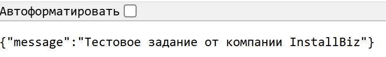

### Допустимые технологии:
- Python 3.12
- FastAPI
- Postgre
- Docker

-------
### Запуск проекта
`docker-compose up --build`

### Я сделал авторизацию через JWT токен, который хранится в cookies

### Реализация
- Чтобы начать работу, нужно добавить файл с переменными окружениями *.env*. Вот пример:

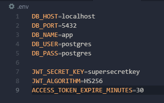

- Также установите зависимости `pip install -r requirements.txt`

- Все эндпоинты
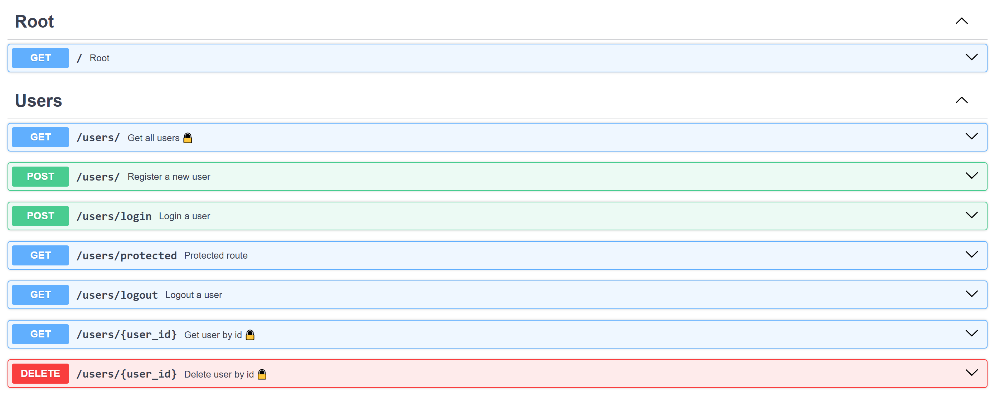
- К эндпоинтам с 🔒 имеет доступ только `ADMIN`

- Зарегистрируемся
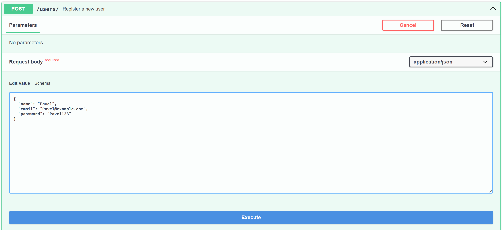
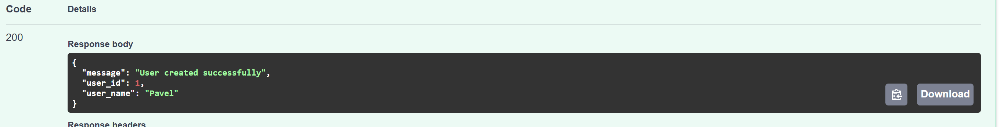
- Мы успешно зарегистрировались

- Теперь аутентифицируемся
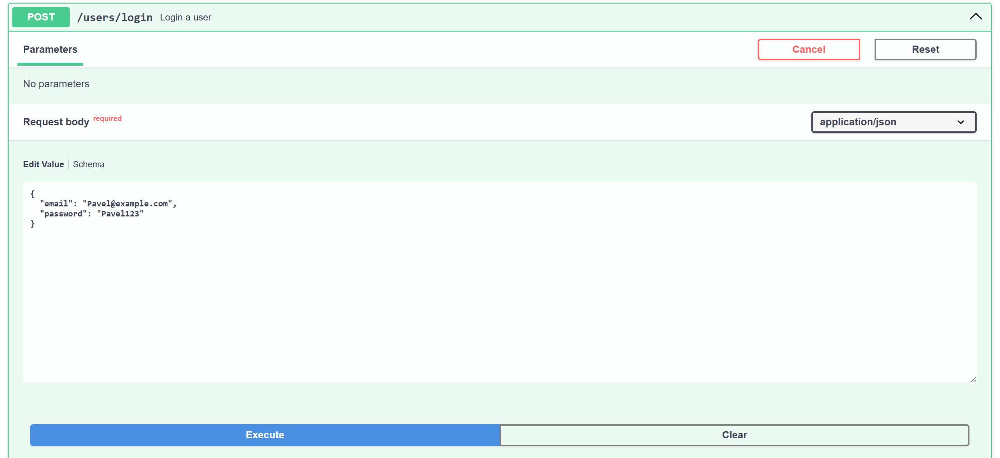
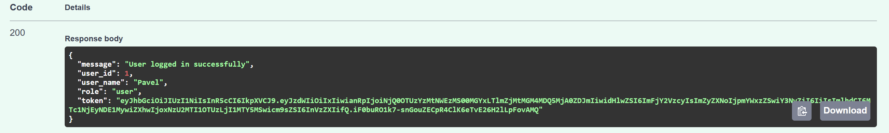
- В ответе можно увидеть, что мы авторизованы как обычный пользователь - `"role": "user"`. `"user"` - дефолтная роль при регистрации, `"admin"` - назначается вручную в БД.
- Если откроем консоль разработчика до и после аутентификации, то увидим, что в cookies появляется JWT токен.
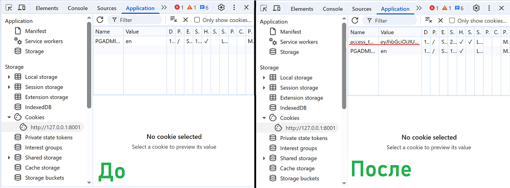

- Теперь нам доступна защищённая информация конкретного пользователя. Также можно посмотреть, что мы авторизованы как обычный пользователь - `"role": "user"`
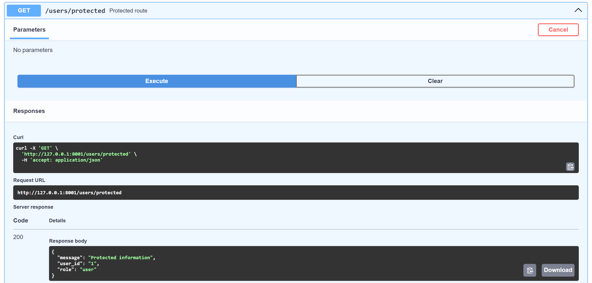

- Можем убедиться, что нам не доступны эндпоинты для `ADMIN`
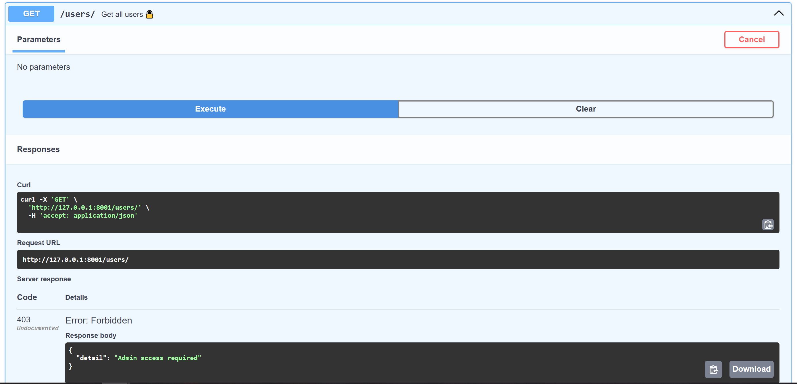

- Зарегистрируем нового пользователя
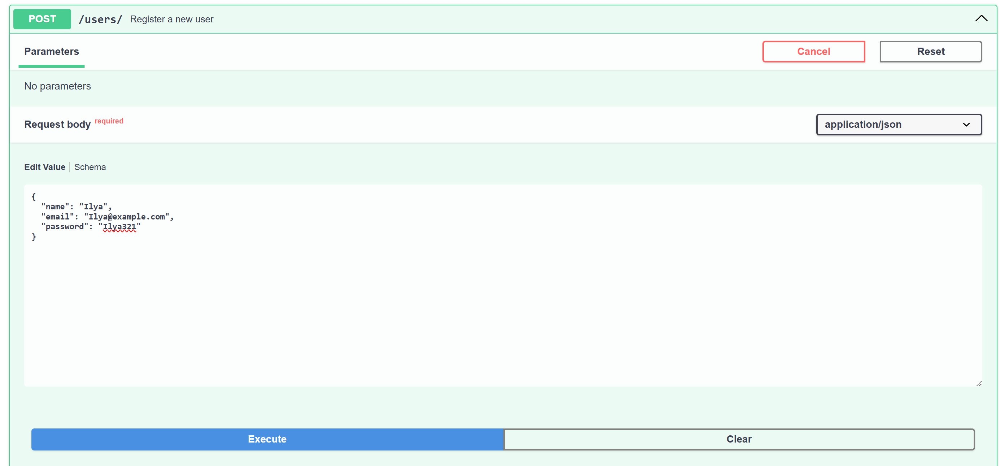
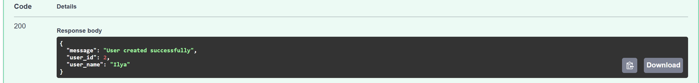

- В базе данных поменяем для нового пользователя роль доступа на `ADMIN`
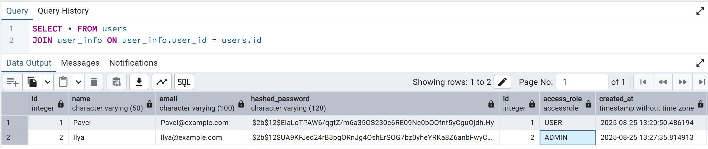
- Можно заметить, что в базе данных пароль хэшируется для безопасности

- Теперь выйдем с аккаунта прошлого пользователя
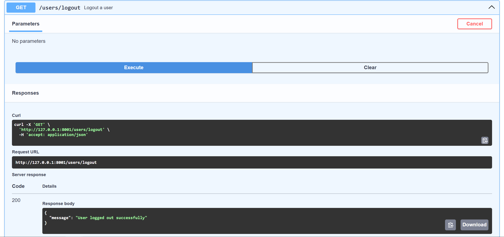

- И аутентифицируемся с новым пользователем
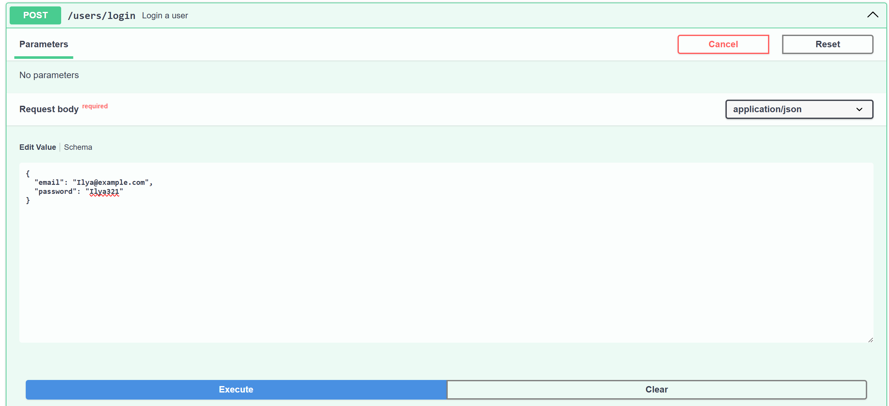
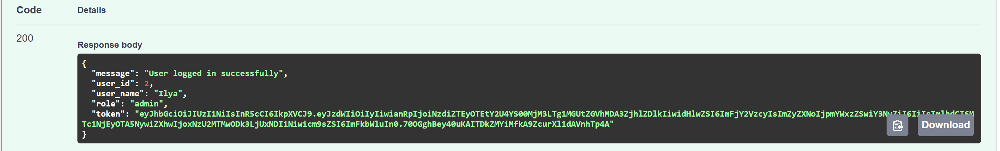
- В теле ответа можно увидеть, что мы авторизованы уже как  `ADMIN` - `"role": "admin"`. Теперь у нас есть доступ ко всем эндпоинтам
- Можно посмотреть всех зарегестрированных пользователей
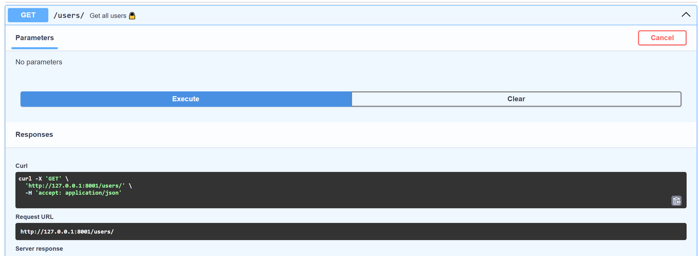
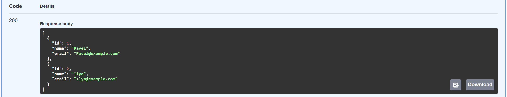
- Можно посмотреть данные пользователя по конкретному `id`
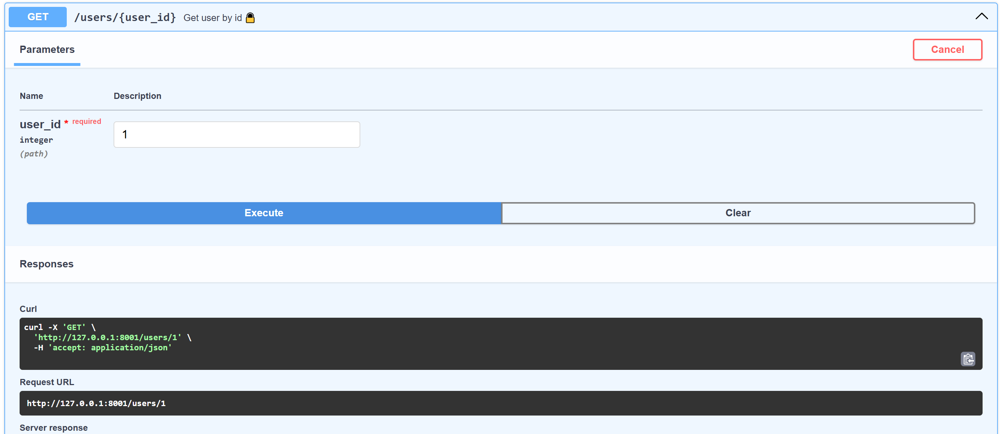
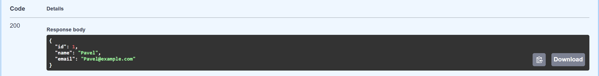
- Можно удалить пользователя по `id`
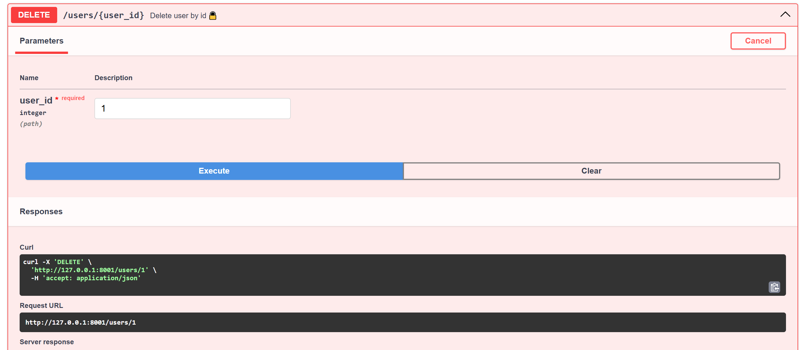
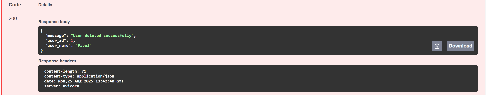
- Убедимся, что остался один пользователь
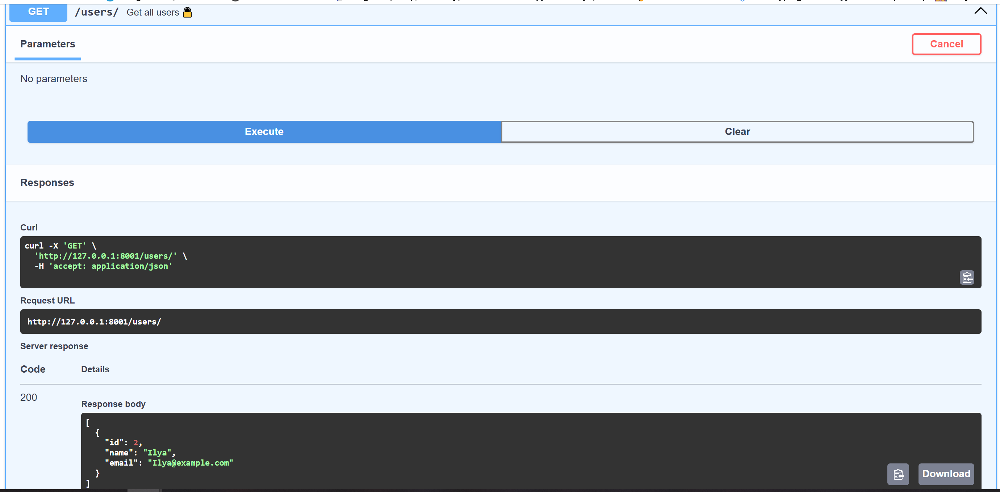

- Спасибо, что прочитали до конца!
